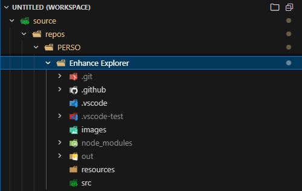
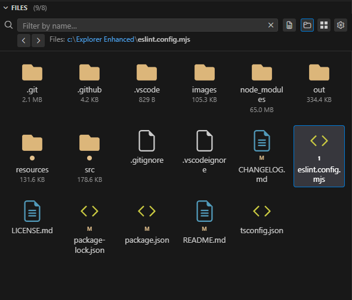
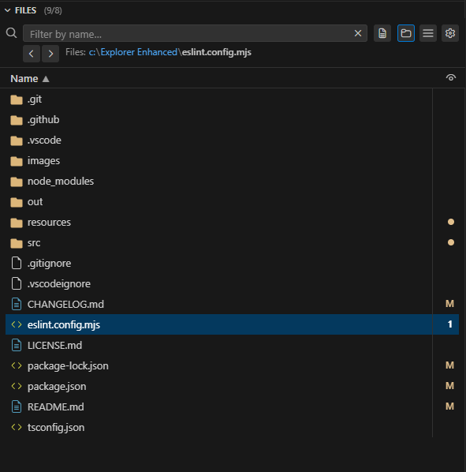
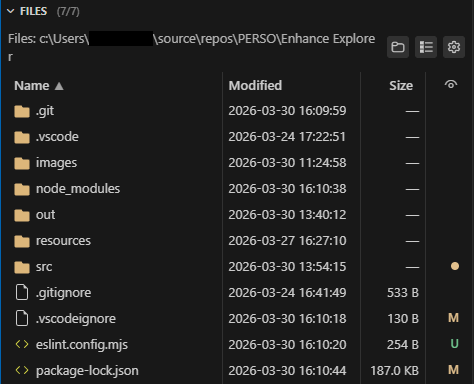

# Explorer Enhanced

Folder-first navigation for VS Code: a dedicated activity bar container with a **Folders** tree and a **Files** webview (name, modified, size, and status columns, codicon toolbar).

**Repository:** [Explorer-Enhanced-For-VsCode](https://github.com/Vince1024/Explorer-Enhanced-For-VsCode)

## Screenshots

### Folders View

<p align="center">
  
</p>
<p align="center"><sub><em><strong>Details</strong> layout: Folders tree + Files table (name, modified, size). Optional <code>images/overview.png</code> can be added later for a wider marketing shot.</em></sub></p>

### Files Views

<table>
  <tr>
    <td align="center" width="30%">
      <br />
      <sub><strong>Icons</strong>: name, size, Git/Problems per toggles.</sub>
    </td>
    <td align="center" width="30%">
      <br />
      <sub><strong>List</strong>: compact row (name + indicators depending on options).</sub>
    </td>
    <td align="center" width="30%">
      <br />
      <sub><strong>Details</strong>: name, modified, size; Git/Problems columns per toggles, column widths.</sub>
    </td>
  </tr>
</table>

## Requirements

- **VS Code** `^1.85.0`
- Built-in **Git** extension (`vscode.git`) — used for Git decorations in **Files** and related behavior.

## Features

### Folders

- Workspace roots and subfolders; optional **Show files in tree** (from the view title menu or commands).
- Context actions: new file/folder, refresh, reveal in OS, integrated terminal, copy path, rename, delete, reveal in built-in Explorer.
- **Folder expand behavior** (see [Settings](#settings)): you can align with the built-in Explorer so a **single click** only **selects** a folder (and drives the **Files** view), while **expand/collapse** uses the **twistie (`>`)** or a **double-click** on the folder label. This is implemented by syncing `workbench.tree.expandMode` at **workspace** scope when you choose that mode in settings (see limitations below).

### Files

- Table or icon layout: sortable columns, resizable widths, optional Git status, problems counts, folder sizes, path hint, layout switcher (list / details / icons).
- Git badges mirror the built-in Explorer where possible: working tree + index, merge/conflict, and **incoming (upstream)** when behind a tracked branch.

## Settings

| ID | Description |
|----|-------------|
| `explorer-enhanced.files.dateTimeFormat` | How **Modified** is formatted (`locale`, `iso`, `relative`, `custom`, …). |
| `explorer-enhanced.files.dateTimeCustomPattern` | Pattern when format is `custom` (tokens: `YYYY`, `MM`, `DD`, `HH`, `mm`, `ss`, …). |
| `explorer-enhanced.folders.folderExpandInteraction` | How **Folders** tree rows expand. See [Folder expand interaction](#folder-expand-interaction). |

Additional options (subfolders in list, Git/problems columns, etc.) are exposed from the **Files** view settings menu and stored in workspace state.

### Folder expand interaction

| Value | Behavior |
|-------|----------|
| `inherit` (default) | The extension does **not** change `workbench.tree.expandMode`. Use your existing VS Code / workspace preference. |
| `doubleClick` | Sets **`workbench.tree.expandMode`** to **`doubleClick`** for the **current workspace**. Single click on a **folder** row selects only; the **twistie** or **double-click** on the label toggles expand/collapse. |
| `singleClick` | Sets **`workbench.tree.expandMode`** to **`singleClick`** for the workspace (classic tree: one click on the row toggles). |

**Important**

- Applying `doubleClick` or `singleClick` updates **workspace** settings, so **other sidebar trees** in the same workspace (built-in Explorer, SCM, …) use the same expand mode.
- **File** nodes in the Folders tree (when “files in tree” is enabled) still **open on single click** because they use `vscode.open`. VS Code does not apply tree expand mode to items that define a `command`.

To configure expand behavior globally without the extension writing the workspace file, set **`Workbench › Tree: Expand Mode`** (`workbench.tree.expandMode`) yourself and keep **`Folders: Folder Expand Interaction`** on **`inherit`**.

## Commands

Use the Command Palette (`Explorer Enhanced:`) for focus, layout, toggles (subfolders in list, files in folder tree), and folder context actions when invoked from the tree.

## Development

```bash
npm install
npm run compile
```

Press **F5** in VS Code to launch the **Extension Development Host** (see `launch.json` / `tasks.json`).

```bash
npm run lint
npm run package   # VSIX via vsce
```

## Changelog

See [CHANGELOG.md](./CHANGELOG.md).
