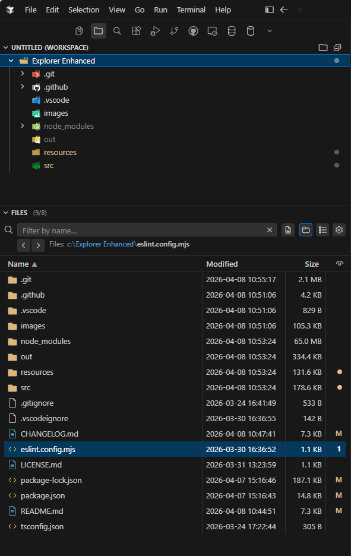
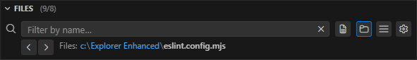
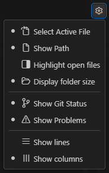

# Explorer Enhanced

Folder-first navigation for VS Code: a dedicated activity bar container with a **Folders** tree and a **Files** webview (name, modified, size, and status columns, codicon toolbar).

**Repository:** [Explorer-Enhanced-For-VsCode](https://github.com/Vince1024/Explorer-Enhanced-For-VsCode)

**Release notes:** [CHANGELOG.md](CHANGELOG.md)

## Screenshots

### Full View

<p align="center">
  
</p>
<p align="center"><sub><em><strong>Details</strong> layout: Folders tree + Files table (name, modified, size). Optional <code>images/overview.png</code> can be added later for a wider marketing shot.</em></sub></p>

### Files Features/Options

<table>
  <tr>
    <td align="center" width="10%">
      <br />
      <sub><strong>TopBar</strong>: Search (Name/File content), Navigation, Show/Hide Folders in files view, Select View and <strong>Options</strong></sub>
    </td>
    <td align="center" width="10%">
      <br />
      <sub><strong>Options</strong></sub>
    </td>
  </tr>
</table>

### Files Views (Icons/List/Details)

<table>
  <tr>
    <td align="center" width="30%">
      <br />
      <sub><strong>Icons</strong>: name, size, Git/Problems.</sub>
    </td>
    <td align="center" width="30%">
      <br />
      <sub><strong>List</strong>: name + Git/Problems.</sub>
    </td>
    <td align="center" width="30%">
      <br />
      <sub><strong>Details</strong>: name, modified, size, Git/Problems.</sub>
    </td>
  </tr>
</table>

## Features

### Folders

- Workspace roots and subfolders; optional **Show files in tree** (from the view title menu or commands).
- **Multi-root workspaces:** drag-and-drop a **workspace folder root** onto another root to reorder (same idea as the built-in Explorer); drop on empty tree area moves the folder to the **end**. Subfolders and files in the tree are not draggable.
- Context actions: new file/folder, refresh, reveal in OS, integrated terminal, copy path, rename, delete, reveal in built-in Explorer.
- **Folder expand behavior** (see [Settings](#settings)): you can align with the built-in Explorer so a **single click** only **selects** a folder (and drives the **Files** view), while **expand/collapse** uses the **twistie (`>`)** or a **double-click** on the folder label. This is implemented by syncing `workbench.tree.expandMode` at **workspace** scope when you choose that mode in settings (see limitations below).

### Files

- Table or icon layout: sortable columns, optional Git status, problems counts, folder sizes, path hint, layout switcher (list / details / icons).
- **Folder row selection:** a **single click** on a **folder** in the listing **highlights** that row and updates the **breadcrumb / path** line to that folder’s path. The file listing **stays** on the folder you had opened; **double-click** still **opens** the folder. Selection is cleared when you open another folder, click a file row, or when the active editor sync updates the path hint for a file.
- **Keyboard in the listing:** **F2** (rename) and **Delete** match the context menu when the **Files** webview has focus (same target order: **selected folder row** → **active-editor** row → last **click**). After you open a file from the list, focus usually moves to the editor: the extension then registers **workbench** keybindings so **F2** / **Delete** still rename/delete that file (or the **selected folder row** if you single-clicked a folder) instead of triggering the editor’s symbol rename (e.g. Markdown headings). Not active while the **filter** field, a **toolbar** menu, or the **context menu** is open.
- **Filter by name:** on the **first row** of the Files pane, the search field shares a line with the view/settings **toolbar** (icons); the **path** sits on the row below and **wraps** on long paths. Filtering applies to **List**, **Details**, and **Icons** (case-insensitive substring). Matching substrings in file and folder **names** are highlighted using theme colors (`list.filterValue*`, then editor find-match / selection highlight fallbacks). The query is cleared when you open a different folder; **Esc** or the **`codicon-close`** button (visible when the field is not empty) clears the filter. The field uses **`role="searchbox"`** for accessibility (`type="text"` so the clear control renders reliably in the webview).
- **Search in file contents:** the **`codicon-file-text`** toggle switches the same field to a **recursive text search** under the currently selected folder (debounced). The extension reads candidate files as UTF-8 with sensible exclusions and limits (see `src/filePaneContentSearch.ts`). While a search runs, you get **window progress** and a **spinner overlay** in the webview; the table lists matching files only. The choice is remembered per workspace. When you **open** a hit, the editor’s **native Find** bar opens **prefilled** with the same query (case-insensitive). The **Replace** row stays **collapsed** (expand with the widget chevron if needed); use **F3** / **Shift+F3** to jump between matches. With **Select Active File** enabled, the **Folders** tree still follows the open file, but the **Files** listing **stays** on your content-search results (the query is not cleared just because the hit lives in a subfolder).
- **Column widths (List + Details):** **Name** uses the remaining horizontal space. **Modified**, **Size**, and the combined **Git / Problems** column use **fixed pixel** widths (drag the header separators). The Git/Problems width is **shared** between List and Details: resizing in one view applies to the other. Values are stored in workspace state under `explorer-enhanced.filePane.detailColWidthsPx` (triplet `[modifiedPx, sizePx, statusPx]`). Min/max bounds are defined once in the extension and passed into the webview at load so the UI and host validation stay aligned.
- Git badges mirror the built-in Explorer where possible: working tree + index, merge/conflict, and **incoming (upstream)** when behind a tracked branch.
- **Symlink / junction** rows use dedicated codicons (`file-symlink-file`, `file-symlink-directory`) when the entry is a symbolic link or junction (Windows).
- **Highlight open files** (optional): open editor tabs are indicated by **link-colored text** (`textLinkForeground`), not a row background.
- **Context menu (Git):** on files with pending changes, **Git: Stage**, **Git: Discard Changes**, and **Git: Unstage** call the built-in Git commands (when the Git column data is available).
- **Follow .lnk links** (Windows, optional setting): opening a `.lnk` shortcut from **Files** or related context actions can resolve and open the **target** instead of the binary shortcut.

## Settings

| ID | Description |
|----|-------------|
| `explorer-enhanced.focusOnStart` | When `true`, Explorer Enhanced receives focus every time a window opens or reloads (see [Focus on Start](#focus-on-start)). Default: `false`. |
| `explorer-enhanced.folders.folderExpandInteraction` | How **Folders** tree rows expand. See [Folder expand interaction](#folder-expand-interaction). |
| `explorer-enhanced.files.dateTimeFormat` | How **Modified** is formatted (`locale`, `iso`, `relative`, `custom`, …). |
| `explorer-enhanced.files.dateTimeCustomPattern` | Pattern when format is `custom` (tokens: `YYYY`, `MM`, `DD`, `HH`, `mm`, `ss`, …). |
| `explorer-enhanced.files.followLnkLinks` | On **Windows**, open Shell Link **targets** for `.lnk` files instead of the shortcut file. Default: `false`. |

Additional options (subfolders in list, Git/problems columns, etc.) are exposed from the **Files** view settings menu and stored in workspace state.

### Folder expand interaction

| Value | Behavior |
|-------|----------|
| `inherit` (default) | The extension does **not** change `workbench.tree.expandMode`. Use your existing VS Code / workspace preference. |
| `doubleClick` | Sets **`workbench.tree.expandMode`** to **`doubleClick`** for the **current workspace**. Single click on a **folder** row selects only; the **twistie** or **double-click** on the label toggles expand/collapse. |
| `singleClick` | Sets **`workbench.tree.expandMode`** to **`singleClick`** for the workspace (classic tree: one click on the row toggles). |

**Important**

- Applying `doubleClick` or `singleClick` updates **workspace** settings, so **other sidebar trees** in the same workspace (built-in Explorer, SCM, …) use the same expand mode.
- **File** nodes in the Folders tree (when “files in tree” is enabled) still **open on single click** because they use `vscode.open`. VS Code does not apply tree expand mode to items that define a `command`.

To configure expand behavior globally without the extension writing the workspace file, set **`Workbench › Tree: Expand Mode`** (`workbench.tree.expandMode`) yourself and keep **`Folders: Folder Expand Interaction`** on **`inherit`**.

### Focus on Start

When **`explorer-enhanced.focusOnStart`** is `true`, the extension switches the sidebar to Explorer Enhanced every time a VS Code window opens or reloads. The extension uses the `onStartupFinished` activation event and a progressive retry mechanism so the focus command runs after VS Code finishes restoring its own UI.

This is **not** the same as a native "restore last Activity Bar view" setting — that does not exist in VS Code. This option **unconditionally** focuses Explorer Enhanced regardless of which view was active before.

## Requirements

- **VS Code** `^1.85.0`
- Built-in **Git** extension (`vscode.git`) — used for Git decorations in **Files** and related behavior.

## Commands

Use the Command Palette (`Explorer Enhanced:`) for focus, layout, toggles (subfolders in list, files in folder tree), and folder context actions when invoked from the tree.

## Development

```bash
npm install
npm run compile
```

Press **F5** in VS Code to launch the **Extension Development Host** (see `launch.json` / `tasks.json`).

```bash
npm run lint
npm run package   # VSIX via vsce
```

### Open VSX only (retry without bumping version)

If **Deploy Extension** built a release but **Open VSX** failed while the Marketplace step succeeded, do **not** re-run the full deploy (that would compute a **new** patch version). Instead:

1. **GitHub Actions → Publish Open VSX only → Run workflow** and set **version** to the semver of the existing release (e.g. `1.0.4`, no `v`). The workflow downloads `explorer-enhanced-{version}.vsix` from that release and runs `ovsx publish` using `OPENVSX_TOKEN`.

2. **Or locally** (after downloading the VSIX from the release page):

   ```bash
   npx ovsx publish -p "$OVSX_PAT" explorer-enhanced-1.0.4.vsix
   ```

   On Windows PowerShell, set `$env:OVSX_PAT` to your Open VSX token (or use `-p` with the token string — avoid committing it).

## Changelog

See [CHANGELOG.md](./CHANGELOG.md).
